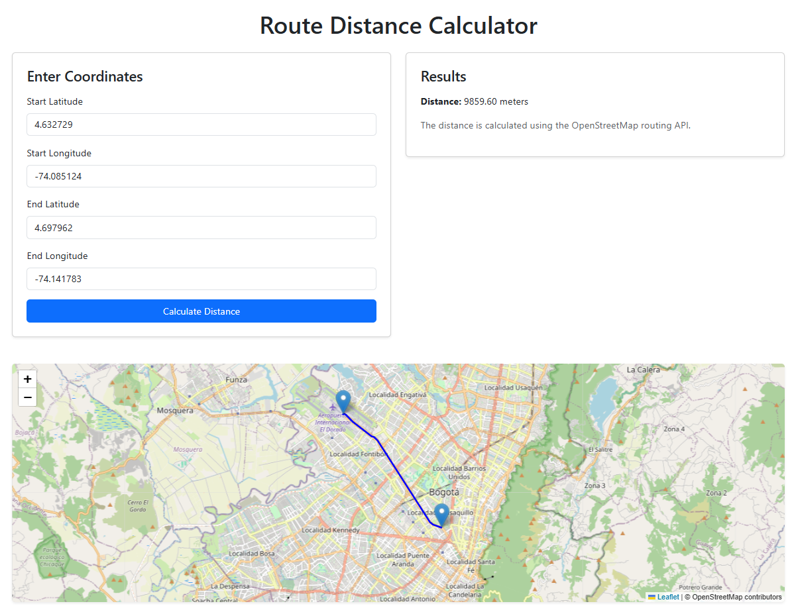

# route-calculator

## Description
Service for route calculator based on OSRM OpenStreetMap data.

## Running the project

To run the project, run the following command:

```bash
npm start
```

## Visualizing the project

To visualize the project, go to the following URL:

```
http://localhost:3000
```



## Author

- [Raul Bolivar Navas](https://rasysbox.com)

## License
MIT
