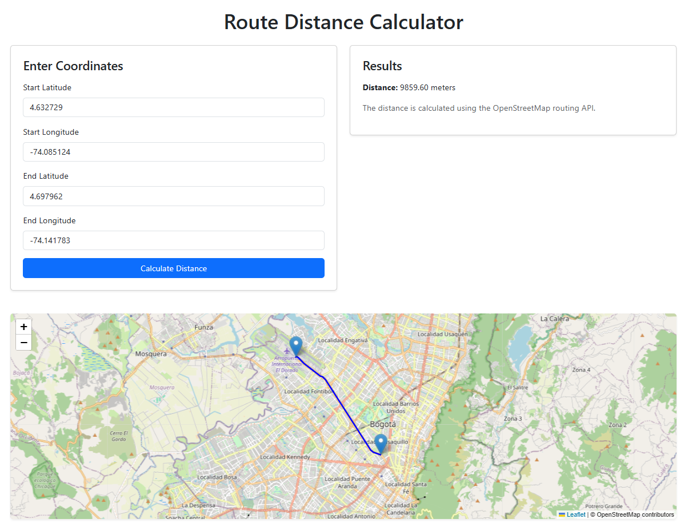

# route-calculator

## Description
Service for route calculator based on OSRM OpenStreetMap data.

## Running the project

To run the project, run the following command:

```bash
npm start
```

## Setting up the project

To set up the project, run the following command:

- For online mode uncomment the following line in the `src/index.js` file:

```javascript
// const route-backend = new OSRM({ path: 'https://router.project-osrm.org/route/v1/driving/' });
```

- For offline mode, download the data from the following URL:

```javascript
// const response = await fetch(`http://localhost:5000/route/v1/driving/${startLng},${startLat};${endLng},${endLat}?overview=full`);
```

- Run the following command to start the OSRM server:

```bash
docker run -t -i -p 5000:5000 osrm/osrm-backend osrm-routed --algorithm mld /route-backend/data/planet-latest.route-backend
```

## Backend

In the backend, we use the OSRM library to calculate the route between two points. The OSRM library is a high-performance routing engine for shortest paths in road networks. It is based on OpenStreetMap data.

### Deploying the OSRM server 

To deploy the OSRM server, run the following command:

Obtain the data from the following URL: https://download.geofabrik.de/south-america/colombia-241123.osm.pbf

```bash
docker build -t osrm-backend-alpine:v3.20.3 -f ./docker/Dockerfile-alpine .
```

```bash
docker-compose -f route-backend/docker-compose.yml up --build
```

- [OSRM](https://download.geofabrik.de/south-america/colombia-latest.osm.pbf)

## Visualizing the project

To visualize the project, go to the following URL:

```
http://localhost:3000
```



## Author

- [Raul Bolivar Navas](https://rasysbox.com)

## License
MIT
